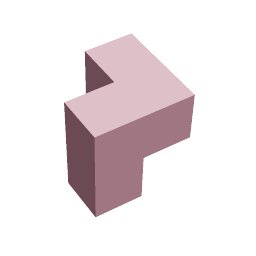

# 3D-tris

A game and an experiment on using WebGL, Emscripten and ARCore.

## Building the browser version

The browser version can be built like this

 1. Install [Emscripten](https://kripken.github.io/emscripten-site/docs/getting_started/downloads.html)
 1. locate `emsdk_env.sh` and set that in the root `Makefile`
 1. Run `make browser` (also try `make test`)
 1. `cd browser`
 1. `python -m SimpleHTTPServer`
 1. Go to http://localhost:8000/ (and http://localhost:8000/test/)

There is also an old [JavaScript-only version](https://github.com/oseiskar/3dtris/releases/tag/js-only),
hosted in https://oseiskar.github.io/3dtris/ which works without this complicated
build process.

## ARCore version for Android

Import `android_ar/build.gradle` to Android Studio 3+ and run.

## Copyright & License info

See `COPYRIGHT.md` for the licences of the included JS libraries.
